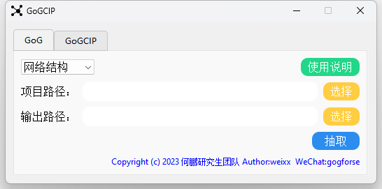
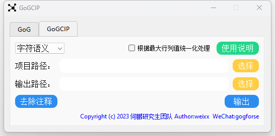

# gogTools
软件工程领域：

①图中图结构特征特征

②代码语义特征

提取工具

## 使用说明

```一、网络结构抽取：
进入qt/dist
点击运行gog.exe
首次运行可能启动时间较长
```


## 使用说明

### 一、GoG

```
一、网络结构抽取：
-项目路径：由DependencyFinder工具生成的结构化XML文件

-输出路径：三种粒度链接关系文件保存路径

-输出：三种粒度链接关系文件①P2P文件包粒度②C2C文件类粒度③F2F文件方法粒度

二、图中图结构抽取：
项目路径：由网络结构抽取生成的结构化F2F文件

-输出路径：三种链接关系的简化文件保存路径

-输出：三种链接关系的简化①去除括号的name文件②只保留方法属性关系的simple文件③图中图文件graph

本软件为软件学报论文-《基于图中图卷积神经网络的软件系统中类交互关系预测》中所提出的GoGCN方法的图中图特征提取工具，不包含模型训练


Copyright (c) 2023 湖北大学 何鹏研究生团队  Authur:卫操   WeChat:gogforse"
```



### 二、GoGCIP

```
一、使用步骤：
-项目路径：需要处理的Java项目代码路径，注意是包含.java文件的项目，点击后方选择按钮进行选择

-输出路径：语义特征生成后的保存路径，点击后方选择按钮进行选择

-去除注释：本软件仅处理不带注释的Java文件，源代码可用该功能生成Java文件，源文件保存为.bat后缀

-语义特征下拉框：选择需要提取的对应语义特征

-输出：点击后对源文件进行语义特征抽取

-根据最大行列值统一化处理：勾选后会进一步生成大小统一的数组文件，耗时较大，运行时软件可能卡顿，等待即可，可根据生成的-datanfo.txt-文件查看数据大小


二、输出数据说明：
-ASCII:①Source为字符语义原始数组②Normalize为字符语义统一维度的数据③dataInfo为数据信息

-Token:①dataset为全部token②embedding为类对象的语义特征③w2vdata为word2vec模型

-RGB:①Source为视觉语义原始数组②Normalize为视觉语义统一维度的数据③PNG为rgb结构的数组数据④Photos为对应类对象的图片⑤dataInfo为数据信息

本软件为湖北大学硕士论文-《基于图中图神经网络的软件系统中类交互关系预测研究》中所提出的GoGCIP方法的代码语义特征数组提取工具，不包含模型训练

Copyright (c) 2023 湖北大学 何鹏研究生团队  Authur:卫操   WeChat:gogforse"
```


